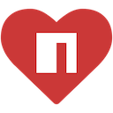

<div align="center">
    
</div>
<h2 align="center">npm faves</h2>

<p align="center">Manage your favorite node packages directly from Google Chrome</p>

<p align="center">
    
    
    
</p>

<p align="center">
  <a href="#key-features">Key Features</a> •
  <a href="#how-to-use">How To Use</a> •
  <a href="#why">Why?</a> •
  <a href="#credits">Credits</a> •
  <a href="#license">License</a>
</p>

<table border="0">
<tr>
<td></td>
<td></td>
<td></td>
</tr>
</table>

## Key features

- Add and remove favorite packages directly from [https://www.npmjs.com](https://www.npmjs.com)
- Search packages in the pop up (opens new tab with [https://www.npmjs.com](https://www.npmjs.com))
- View faved packages list in the pop up
- View package information in the pop up
- Sync package information with [https://registry.npmjs.org](https://registry.npmjs.org)
- Remove package from faves from the package information view in the pop up
- Copy to clipboard install snippet from the package information view in the pop up
- View all faved packages with more detailed information (like the date when it was added to faves) in the options page
- Create packages collections
- Manage collection packages
- Download package.json file by collection
- Manage package.json default information

## How To Use

### Chrome Web Store

Install the extension from the [Chrome Web Store](https://chrome.google.com/webstore/detail/npm-faves/lgcedkogdjoickahfdegicgmbkloaaem).

### Release

Download the latest [release](https://github.com/tulu/chrome-extension-npm-faves/releases) and install the extension in Chrome by following the steps:

1. Unzip the release.
2. Go to `Chrome Settings`.
3. Select `Extensions`.
4. Enable `Developer mode`.
5. Click `Load unpacked`.
6. Select the folder where project is. The `manifest.json` file must be on the root of the folder you select.

### Clone, Run, Install

```sh
# clone it
$ git clone https://github.com/tulu/chrome-extension-npm-faves.git

# MOVE!
$ cd chrome-extension-npm-faves

# Install dependencies
$ npm install

# Build it (2 options)

# Builds into the dist folder and watches src files for modifications
$ npm run build-dev

# Builds into the dist folder and creates zip release in release folder
$ npm run build-prod
```

Install the extension following the `Release` option steps. The folder to select is `dist`.

## Why?

As developers we start new projects every now and then and probably we use the same node packages over and over. These are great pieces of code that by using them allow us to focus on our main problems to solve.

The issue is that once we start the project we need to take the packages from somewhere. We may copy them from another `package.json` file, clone a template repo or maybe we already have the `npm install` snippet stored in a file.

Another common issue is when you find a great package that you want to try but then you forget about it. This happens to me a lot.

The idea behind npm faves is to keep track of your favorite npm packages directly in the browser as an extension.

## But I already could do that...

Sure you can! And for those who don't know how to do it yet here is a small tutorial taken directly from [https://docs.npmjs.com/](https://docs.npmjs.com/):

In order to star and unstar packages you need to login first!

### Login

**Add a registry user account:** Create or verify a user named `<username>` in the specified registry, and save the credentials to the `.npmrc` file. If no registry is specified, the default registry will be used.

The username, password, and email are read in from prompts.

```sh
$ npm login
```

### Star a package

**Mark your favorite packages:** "Starring" a package means that you have some interest in it. It's a vaguely positive way to show that you care.
It's a boolean thing. Starring repeatedly has no additional effect.

```sh
$ npm star [<pkg>...]
```

### Unstar a package

**Remove an item from your favorite packages:** "Unstarring" a package is the opposite of `npm star`, it removes an item from your list of favorite packages.

```sh
$ npm unstar [<pkg>...]
```

### View stars

**View packages marked as favorites**: If you have starred a lot of neat things and want to find them again quickly this command lets you do just that. You may also want to see your friend's favorite packages, in this case you will most certainly enjoy this command.

```sh
$ npm stars [<user>]
```

That's it! Now you know how to do it through npm CLI!

## Known issues and limitations

- Only available for Google Chrome for now
- When you add a favorite package it takes the latest version
- Faved packages are NOT synchronized with the stars registry. Hopefully someday
- The information is stored in the sync storage of Google Chrome
- The extension uses the latest manifest version 3 so there are some limitations on some features. For example `chrome.notifications.create` [doesn't work yet](https://bugs.chromium.org/p/chromium/issues/detail?id=1168477&q=image%20is%20not%20defined%20notification%20manifest%20v3&can=2).

## Credits

npm faves uses a few third party javascript libraries although the main goal is to keep it simple. As the context of the extensions with manifest v3 is somehow limited the libraries are imported into the scripts folder and some were modified in order to work with the extension. The libraries are included in `/scripts/lib`

- [timeago.js](https://www.npmjs.com/package/timeago.js) - Format the dates in the form of `X time ago` for the package publications.
- [Pretty bytes](https://www.npmjs.com/package/pretty-bytes) - Format the package size from bytes to a human readable string. The library was modified to work on the client side.
- [Google Analytics - analytics.js](https://developers.google.com/analytics/devguides/collection/analyticsjs) - Track the extension usage.
- [Google Analytics - ga.js (Legacy)](https://developers.google.com/analytics/devguides/collection/gajs) - Track the extension usage with the older analytics version. (The usage of this library is implemented but not used)

Besides the javascript libraries other resources are used so the credits to them:

- [chrome.storage.sync API Promise](https://gist.github.com/sumitpore/47439fcd86696a71bf083ede8bbd5466) - To make life easier. Thank you [sumitpore](https://gist.github.com/sumitpore)!
- [Heart loader](https://loading.io/css/) - To make a nice transition when loading the package information.
- [tinygraphs](https://www.tinygraphs.com/) - To show npm user avatars
- [DiceBear Avatars](https://avatars.dicebear.com/) - To show npm user avatars (because one service is not enough)
- The logo was created with svg files from wikimedia: [Heart](https://commons.wikimedia.org/wiki/File:Heart_font_awesome.svg) & [npm logo](https://commons.wikimedia.org/wiki/File:Npm-logo.svg)

## Contributing

Pull requests are welcome. Please open an issue first to discuss what you would like to change.

## License

Distributed under the MIT License. See `LICENSE` for more information.
